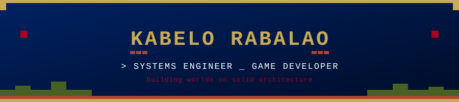

## [ ABOUT ME ]

I am a Software Engineer specializing in **Systems Design** and **Game Development**. I architect the scalable, high-performance backends that power applications and leverage that same engineering rigor in **Unity** and **Godot** to build engaging, interactive worlds. I thrive at the intersection of robust infrastructure and creative technology.

  
  
  

## [ SOCIALS ]

  
  
  

## [ TECH STACK ]

### ┣━ Game Development

  
  
  

### ┣━ Systems & Backend

  
  
  
  

### ┗━ Core Tools

  
  
  
  

## [ GITHUB STATS ]

  
  

  

## [ TROPHIES ]

  

